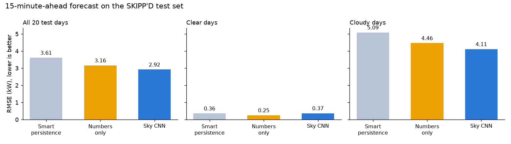
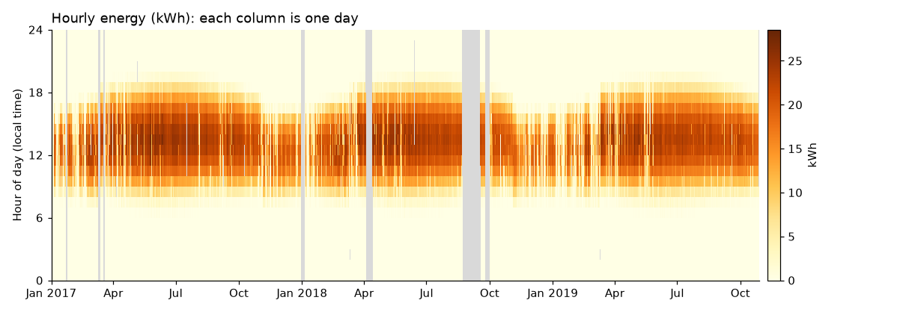
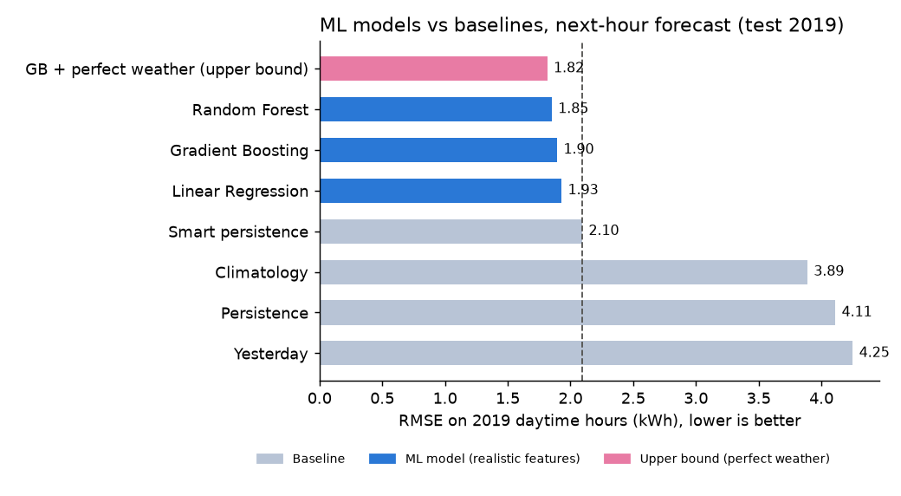
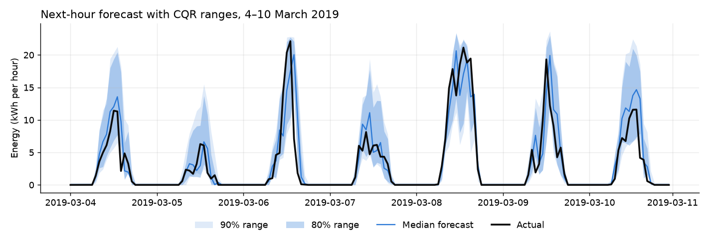
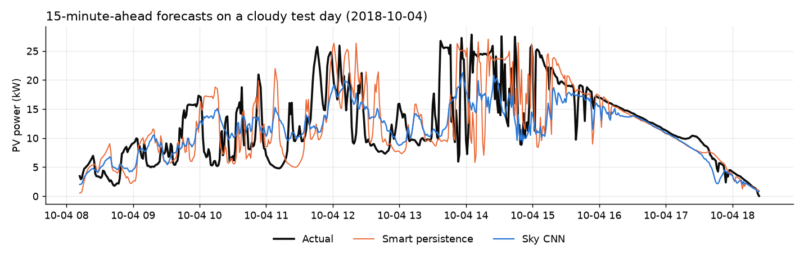

# Solar Power Forecasting: from Weather Data to Sky Images

Forecasting the output of a real solar system (peak about 30 kW) at Stanford University. The project goes from
simple baselines to machine learning, calibrated uncertainty ranges, and a CNN that reads sky-camera
images.

*Rebuilt in 2026 from my undergraduate (B.Tech) final-year project (2022). See [Project history](#project-history).*

## Highlights

| Part | Question | Answer |
|---|---|---|
| Data cleaning | Can the raw data be trusted? | Found and fixed daylight-saving duplicates, 21 outage days, and ~5 weeks of frozen sensor readings |
| ML models (next hour) | Can ML beat the best simple forecast? | Yes. Random Forest cuts the error of smart persistence by **12%** (RMSE 2.10 → 1.85 kWh) |
| Weather data | Does weather help? | Only a little. Even *perfect* weather barely helps, because its 9–25 km grid can't see local clouds |
| Uncertainty | Can we give honest ranges? | Yes. Conformal prediction gives **90% ranges that really cover ~90–93%**, and adapt to cloudy vs sunny days |
| Sky images (15 min ahead) | Does a camera help? | Yes. The CNN beats the same model without images: skill **0.19 vs 0.12**, with most of the gain on cloudy days |
| Data quality | — | Found that the image dataset's timestamps are **1 hour late during daylight saving time**, proved it with solar geometry, and corrected it |



## Contents

1. [Data](#data)
2. [How to run](#how-to-run)
3. [Project structure](#project-structure)
4. [Part 1 · Data cleaning](#part-1--data-cleaning-notebook-01)
5. [Part 2 · Baselines and ML models](#part-2--baselines-and-ml-models-notebooks-0204)
6. [Part 3 · Uncertainty](#part-3--uncertainty-notebook-05)
7. [Part 4 · Sky images](#part-4--sky-images-notebook-06)
8. [Limitations and future work](#limitations-and-future-work)
9. [References](#references)
10. [Project history](#project-history)

## Data

| Data | Source | Used in |
|---|---|---|
| PV power, 1-minute, 2017 – Oct 2019 | **SKIPP'D** raw data, Stanford Digital Repository (CC BY 4.0) | Parts 1–3 |
| Hourly weather (clouds, humidity, sunlight…) | [Open-Meteo Historical Weather API](https://open-meteo.com) (ECMWF reanalysis) | Parts 2–3 |
| 64×64 sky images + PV, 1-minute | **SKIPP'D** benchmark on Hugging Face (`solarbench/SKIPPD`, CC BY 4.0) | Part 4 |
| Sun position, clear-sky sunlight | [pvlib](https://pvlib-python.readthedocs.io) (physics, calculated) | Parts 2–4 |

Data files are not stored in this repo. Download the three PV files into `data/raw/`:

| File | Source |
|---|---|
| `2017_pv_raw.csv` | https://purl.stanford.edu/sm043zf7254 |
| `2018_pv_raw.csv` | https://purl.stanford.edu/fb002mq9407 |
| `2019_pv_raw.csv` | https://purl.stanford.edu/jj716hx9049 |

## How to run

```bash
python3 -m venv .venv
source .venv/bin/activate
pip install -r requirements.txt

python -m src.weather     # hourly weather (Open-Meteo, free, no key)
python -m src.skippd      # sky images, ~2.3 GB (only needed for notebook 06)
```

Then run the notebooks in order: `01_data_cleaning` → `02_baselines` → `03_features` → `04_models` →
`05_uncertainty` → `06_sky_images`. Notebook 06 trains a CNN and uses the GPU of an Apple-chip Mac (MPS)
or an NVIDIA GPU if available. It took about 7 minutes of training on a MacBook Air.

## Project structure

```
data/raw/          original data, never edited (not in the repo)
data/processed/    cleaned data made by the code (not in the repo)
notebooks/         six step-by-step notebooks
src/               reusable code
  data.py            loading and year-based splits
  baselines.py       persistence, climatology, smart persistence
  features.py        weather alignment, pvlib sun features, feature groups
  models.py          shared training helper
  metrics.py         MAE, RMSE, skill score
  uncertainty.py     coverage, interval score, conformal calibration
  weather.py         Open-Meteo download
  skippd.py          sky-image dataset download
  skyimages.py       15-minute samples, timestamp fix, image loading
  skycnn.py          CNN model and training loop (PyTorch)
results/           metrics (CSV), figures, trained CNN weights
```

## Part 1 · Data cleaning (notebook 01)

| Issue found | Fix |
|---|---|
| Daylight-saving duplicates (240 rows) | Converted all times to UTC |
| Small negative values at night | Set to 0 |
| 21 outage days (no power at all) | Marked as missing, not zero |
| Frozen sensor readings, incl. ~10 days (Apr 2018) and ~26 days (Aug–Sep 2018) | Marked as missing |
| Hours with fewer than 50 valid minutes | Marked as missing |



## Part 2 · Baselines and ML models (notebooks 02–04)

**Setup:** predict the next hour's energy (kWh) using only information available now.
Split by year: train 2017 · validation 2018 · test 2019 (never shuffled). Scored on daytime hours only.

**Features:** time and sun position (pvlib), past power, and weather observed in the previous hour.
The weather's sunlight values are labelled at the *end* of each hour, which I confirmed with a
lag-correlation test (best match at −1 hour) and corrected.

Test set (2019), 3,527 daytime hours:

| Model | MAE (kWh) | RMSE (kWh) | Skill vs persistence |
|---|---|---|---|
| Persistence | 3.40 | 4.11 | 0.00 |
| Yesterday, same hour | 2.28 | 4.25 | −0.03 |
| Climatology | 2.46 | 3.89 | 0.05 |
| Smart persistence (best baseline) | 1.22 | 2.10 | 0.49 |
| Linear Regression | 1.19 | 1.93 | 0.53 |
| Gradient Boosting | 1.06 | 1.89 | 0.54 |
| **Random Forest** | **0.99** | **1.85** | **0.55** |
| *Gradient Boosting + perfect weather (upper bound)* | *1.02* | *1.82* | *0.56* |



- Random Forest cuts the error of the best baseline by about 12%. The ranking is the same on the 2018 validation year.
- The most important inputs (permutation importance) are last hour's power, clear-sky sunlight, and last hour's observed sunlight.
- Even *perfect* weather barely helps: reanalysis weather can't see the individual clouds over one building.
  **This motivates the sky-camera part.**

## Part 3 · Uncertainty (notebook 05)

Instead of one number, the model gives a range, such as "90% sure it will be between 8 and 15 kWh".
Train 2017 · calibrate 2018 · test 2019.

| 90% range (test 2019) | Coverage | Width (kWh) | Interval score ↓ |
|---|---|---|---|
| Fixed range (smart persistence ± past errors) | 90% | 6.36 | 10.64 |
| Quantile regression (Gradient Boosting) | 86% ❌ | 4.41 | 6.28 |
| **Conformalized quantile regression (CQR)** | **93%** ✅ | **5.01** | **6.29** |

- Quantile regression alone is overconfident. Conformal calibration (Romano et al., 2019) restores the promised coverage.
- CQR adapts to the weather. It's about 6.9 kWh wide on the cloudiest days and about 4 kWh on sunny ones,
  and it keeps ~90% coverage on cloudy days, where the fixed range drops to 82%.



## Part 4 · Sky images (notebook 06)

**Setup:** the SKIPP'D benchmark task, predicting PV power **15 minutes ahead**, evaluated on the dataset's
**official 20 test days**. Every 5th training day is held out for validation (early stopping).

**Model:** a CNN reads two stacked sky images (now and 6 minutes ago, 6 channels, 64×64), so it can see
cloud movement. A small MLP reads recent power and sun position. The network learns a
**correction to smart persistence** (residual learning), which made training fast and stable.

**Data-quality finding:** during daylight saving time, the timestamps in this release are 1 hour late.
Solar power should centre on solar noon, but summer days were centred at a sun azimuth of 205° vs 187°
in winter. After shifting summer times back 1 hour, both match. Correcting this cut smart persistence's
error on clear days from 1.38 to 0.36 kW.

| 15 min ahead, 20 test days | RMSE all days (kW) | Clear days | Cloudy days | Skill vs smart persistence |
|---|---|---|---|---|
| Smart persistence | 3.61 | 0.36 | 5.09 | 0.00 |
| Numbers only (Gradient Boosting) | 3.16 | **0.25** | 4.46 | 0.12 |
| **Sky CNN (images + numbers)** | **2.92** | 0.37 | **4.11** | **0.19** |



- **The images add real information**, beyond the same model without them, and mostly on cloudy days.
- On clear days everything is already accurate, and the images don't help.

## Limitations and future work

- **One site, about 3 years.** Results may differ elsewhere, for example in a different climate.
- **Weather is reanalysis, not a real forecast.** A live system would use weather forecasts (e.g. NOAA GFS), which are less accurate.
- **The CNN hedges** on very variable days (it's smoother than reality), which is typical of squared-error training.
- **Single random seed** for the CNN. Several seeds would show how stable the result is.
- **Next steps:** longer image sequences (video models), conformal ranges for the 15-minute forecasts,
  longer horizons (30–60 min), and combining satellite images with sky images.

## References

- Nie, Y., Li, X., Scott, A., Sun, Y., Venugopal, V., & Brandt, A. (2023). SKIPP'D: A SKy Images and Photovoltaic
  Power Generation Dataset for short-term solar forecasting. *Solar Energy*. https://doi.org/10.1016/j.solener.2023.03.043
- Romano, Y., Patterson, E., & Candès, E. (2019). Conformalized Quantile Regression. *NeurIPS*.
- Holmgren, W., Hansen, C., & Mikofski, M. (2018). pvlib python: a python package for modeling solar energy systems. *Journal of Open Source Software*.
- Weather data by [Open-Meteo.com](https://open-meteo.com) (ECMWF reanalysis).

## Project history

This started as my B.Tech final-year project in 2022: a Kaggle dataset, a Flask web page, and a comparison
of Linear Regression, SVR, Random Forest and an LSTM, evaluated with a random train/test split.

In 2026 I rebuilt it as a research-style project:

- a public, citable dataset with a known location
- time-based evaluation with no shuffling and no leakage
- physics features (pvlib), strong baselines, calibrated uncertainty, and a sky-image CNN

## License

Code: MIT (see `LICENSE`). Data: SKIPP'D is CC BY 4.0; weather data by Open-Meteo.com. Data files are not included.

## Author

**Gayatri Ravada** · M.S. Computer Science, California State University, East Bay
